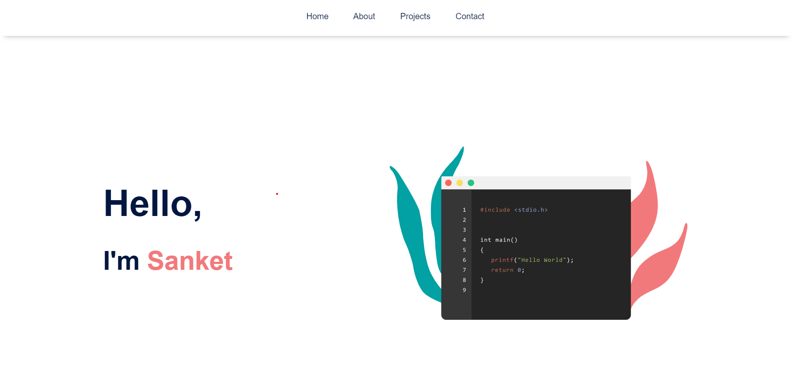

# CODSOFT_Intern_Simple_LandingPage
Welcome to my CODSOFT internship project repository! 🚀 This repository showcases a sleek and interactive landing page crafted with HTML and CSS. 

 

## Key Features:
- Responsive Design 📱
- Interactive Elements 🎨
- Project Showcase 🚀

# Technologies Used:
- HTML
- CSS

## Funny Note 😄
I intentionally kept this project at the "beginner's level," making it a breeze for me! Easy peasy coding! 

## Explore the Project:
- [Live Project](https://sanket-santoki.github.io/CODSOFT_Intern_Simple_LandingPage/)
- [GitHub Profile](https://github.com/sanket-santoki)

# Credits:
- Developed by Sanket Santoki
- Internship at CODSOFT

Feel free to clone, fork, or explore the code. Your feedback and suggestions are highly appreciated! Let's continue the coding adventure together. 💻🌐

#CODSOFTInternship #WebDevelopment #HTML #CSS #TechEnthusiast
